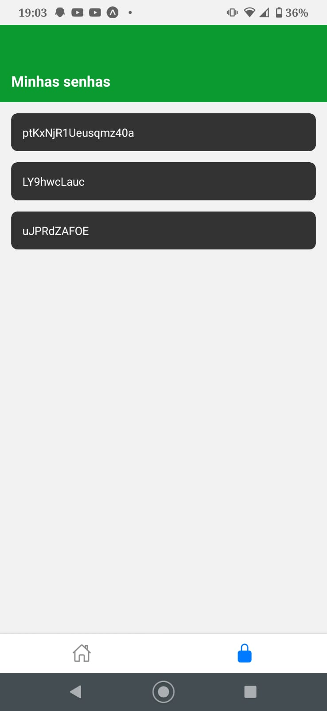

# Gerador de Senha Forte em React Native

Este é um projeto de um gerador de senha forte em React Native, que permite gerar senhas seguras e armazená-las localmente. O aplicativo possui várias funcionalidades, incluindo a geração de senhas, a visualização das senhas geradas, a capacidade de copiar senhas para a área de transferência e salvar senhas para referência futura.

# 👥 Confira:

### Processo de Geração de Senha

<ul style="list-style-type:none; display:flex; justify-content:space-between;">
  <li>
    
  </li>
  <li>
    
  </li>
  <li>
    
  </li>
  <li>
    
  </li>
</ul>

## Estrutura do Projeto

O projeto está estruturado em vários componentes que se comunicam para fornecer uma experiência completa. Vamos dar uma olhada na estrutura geral do projeto e depois mergulhar nos detalhes de cada componente.

### Componentes Principais

1. **ModalPassword**: Este componente exibe a senha gerada em um modal. Ele permite copiar a senha para a área de transferência e salvar a senha no armazenamento local.

2. **Home**: A tela inicial do aplicativo, onde os usuários podem ajustar o tamanho da senha a ser gerada e clicar para gerar uma nova senha.

3. **Passwords**: Esta tela exibe todas as senhas previamente geradas e armazenadas localmente.

### Outros Componentes

1. **PasswordItem**: Um componente simples para exibir cada senha na tela de senhas. Os usuários podem remover uma senha pressionando-a por um longo período de tempo.

### Hooks e Armazenamento

1. **useStorage**: Um hook personalizado que encapsula o armazenamento e recuperação de senhas usando o AsyncStorage. Ele fornece métodos para buscar, salvar e remover senhas do armazenamento local.

## Fluxo do Aplicativo

Aqui está uma descrição do fluxo geral do aplicativo:

1. Na tela inicial (Home), os usuários podem ajustar o tamanho da senha desejada usando um controle deslizante.

2. Ao clicar no botão "Gerar senha", o aplicativo gera uma senha forte de acordo com o tamanho selecionado.

3. A senha gerada é exibida em um modal (ModalPassword), que também oferece a opção de copiar a senha para a área de transferência ou salvar a senha localmente.

4. As senhas salvas são exibidas na tela "Senhas" (Passwords), onde os usuários podem removê-las pressionando-as por um longo período de tempo.

## Código do Projeto

Aqui está uma visão geral do código do projeto:

- O código do projeto está organizado em vários componentes e um arquivo de armazenamento personalizado (useStorage) para a manipulação de senhas.
- Ele usa o React Navigation para criar uma navegação entre as telas "Home" e "Senhas".
- O aplicativo usa o AsyncStorage para armazenar e recuperar as senhas localmente.
- O componente "ModalPassword" exibe a senha gerada em um modal e oferece opções para copiar e salvar a senha.
- O componente "Home" permite que os usuários gerem senhas com o tamanho desejado.
- O componente "Passwords" exibe todas as senhas previamente geradas e permite a exclusão delas.
- O componente "PasswordItem" exibe cada senha na tela de senhas, com a opção de removê-la por um longo período de pressionamento.

